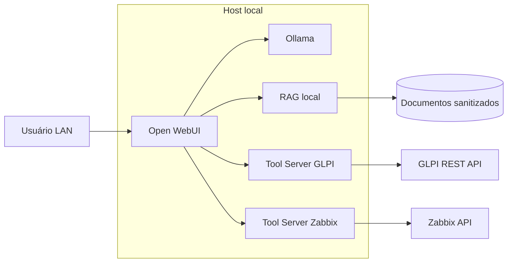

# SENTINELA-AI


Assistente de IA self-hosted para apoio à infraestrutura de TI, suporte técnico e operação em redes restritas, com foco em uso local, privacidade, automação e integração com ferramentas como GLPI, Zabbix e bases documentais internas.

> Este repositório usa exemplos fictícios e sanitizados. Não publique IPs reais, senhas, tokens, nomes internos de servidores ou dados institucionais sensíveis.

---

## Visão geral

O **SENTINELA-AI** é um projeto de laboratório e portfólio voltado para criar um ambiente local de IA para:

- consultar documentações técnicas;
- apoiar atendimento e triagem de chamados;
- integrar dados de monitoramento e inventário;
- usar modelos locais com Ollama;
- rodar em ambiente LAN-only ou offline-first;
- reduzir dependência de serviços externos.

---

## Casos de uso

- Assistente interno para Service Desk.
- Consulta rápida a runbooks e bases de conhecimento.
- Apoio a troubleshooting de Linux, redes, GLPI, Zabbix e Windows Server.
- Integração futura com APIs de GLPI e Zabbix.
- Automação assistida para rotinas de infraestrutura.

---

## Arquitetura



---

## Stack principal

- **Docker / Docker Compose**
- **Open WebUI**
- **Ollama**
- **Linux Server**
- **RAG com documentos locais**
- **GLPI API** em desenvolvimento
- **Zabbix API** em desenvolvimento
- **Shell Script**
- **Python / FastAPI** planejado para tool servers

---

## Quick start

Clone o repositório:

```bash
git clone https://github.com/lteodoro780/SENTINELA-AI.git
cd SENTINELA-AI
```

Crie o arquivo de ambiente:

```bash
cp deploy/.env.example deploy/.env
```

Edite as variáveis:

```bash
nano deploy/.env
```

Suba o ambiente:

```bash
docker compose -f deploy/compose.yaml up -d
```

Verifique:

```bash
docker compose -f deploy/compose.yaml ps
```

Acesse:

```text
http://localhost:3000
```

---

## Estrutura do projeto

```text
SENTINELA-AI/
├── .github/
│   ├── ISSUE_TEMPLATE/
│   └── workflows/
├── deploy/
│   ├── compose.yaml
│   └── .env.example
├── docs/
│   ├── architecture.md
│   ├── env-and-secrets.md
│   ├── rag.md
│   ├── deployment/
│   └── integrations/
├── scripts/
├── services/
│   ├── openapi-glpi/
│   └── openapi-zabbix/
├── README.md
├── CHANGELOG.md
├── SECURITY.md
├── CONTRIBUTING.md
└── LICENSE
```

---

## Documentação

- [Arquitetura](docs/architecture.md)
- [Deploy com Docker Compose](docs/deployment/compose.md)
- [Variáveis e segredos](docs/env-and-secrets.md)
- [RAG e base documental](docs/rag.md)
- [Integração GLPI](docs/integrations/glpi.md)
- [Integração Zabbix](docs/integrations/zabbix.md)

---

## Segurança

Este projeto pode lidar com informações sensíveis em ambientes reais. Por isso:

- não versione `.env`;
- não publique tokens de API;
- não publique IPs internos reais;
- não publique nomes reais de servidores;
- não publique dumps de banco;
- não publique inventário institucional real;
- use dados fictícios nos exemplos.

Veja também: [SECURITY.md](SECURITY.md)

---

## Roadmap

### 0.2.0 - Higiene do repositório

- [x] Reestruturação inicial.
- [x] README profissional.
- [x] Compose limpo.
- [x] Templates de issue e PR.
- [x] Política de segurança.
- [ ] CI com validação de scripts e Compose.
- [ ] Sanitização completa do histórico.

### 0.3.0 - Tool server GLPI

- [ ] Serviço FastAPI para consultar chamados.
- [ ] Exemplo de autenticação via token.
- [ ] Testes unitários.
- [ ] Documentação de endpoints.

### 0.4.0 - Tool server Zabbix

- [ ] Serviço FastAPI para consultar hosts.
- [ ] Consulta de grupos, hosts e interfaces.
- [ ] Testes unitários.
- [ ] Documentação de endpoints.

---

## Autor

Desenvolvido por [@lteodoro780](https://github.com/lteodoro780), com foco em infraestrutura de TI, automação, Linux, redes, monitoramento e IA local.

---

## Licença

Este projeto está licenciado sob a licença MIT.
